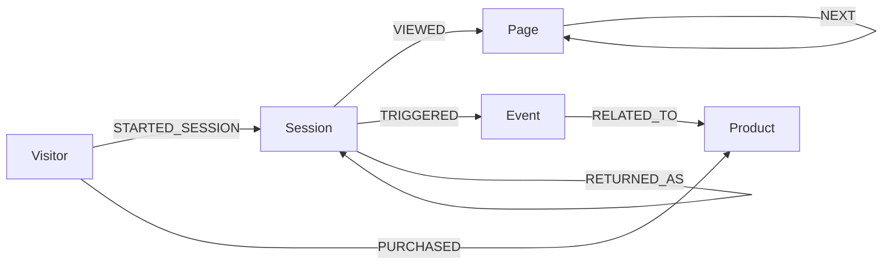
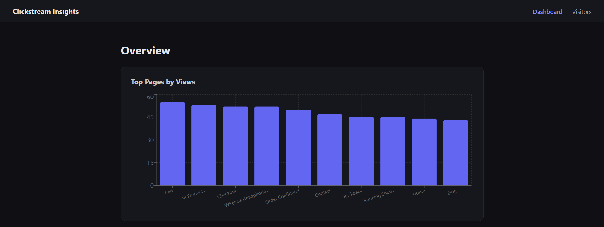
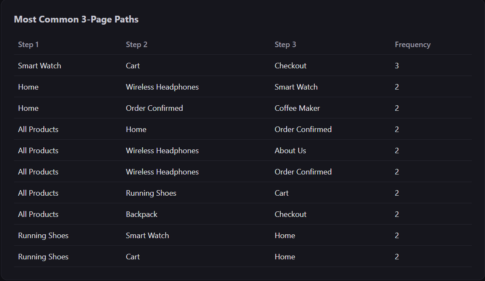
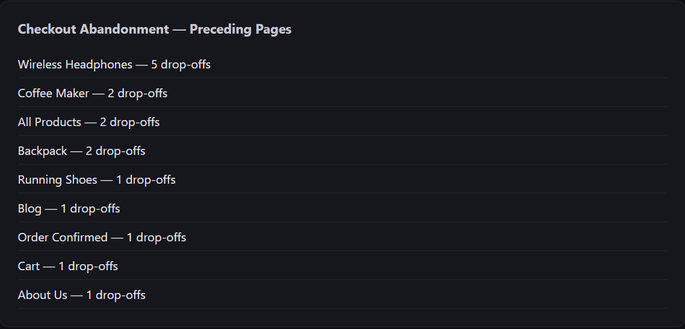
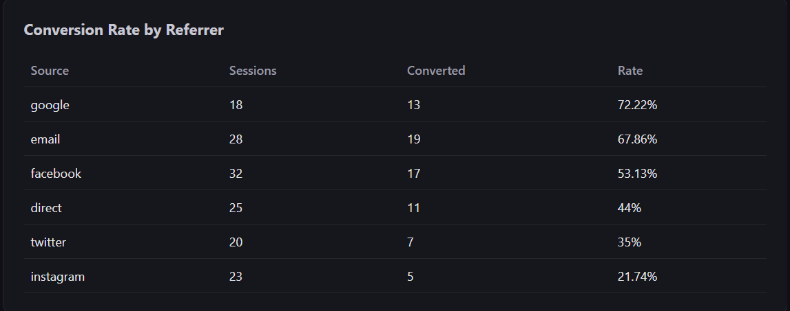
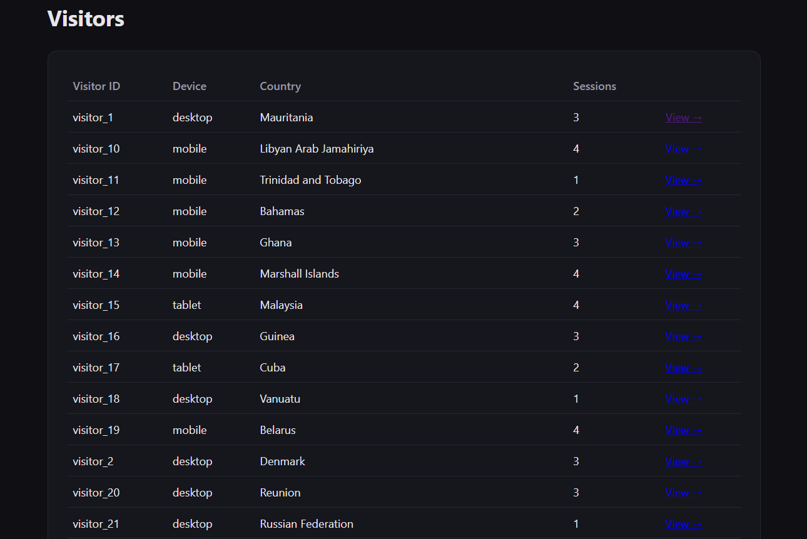
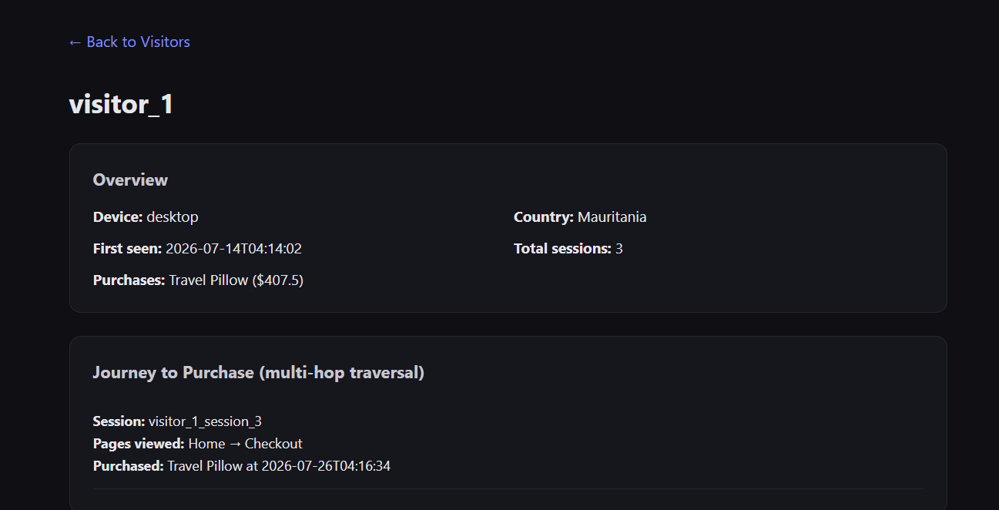
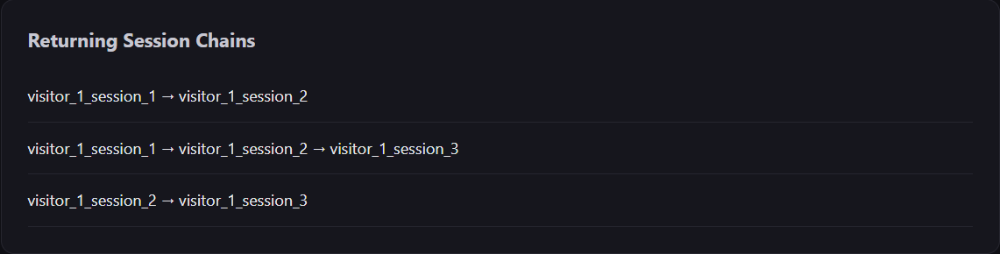

# Clickstream Insights — Web Visitor & Journey Analysis on CognoDB

A full-stack web application that models website visitor behavior — page views,
sessions, events, and purchases — as a graph, and surfaces insights (common
browsing paths, checkout abandonment points, referrer conversion rates, and
individual visitor journeys) that are naturally graph-shaped questions.

Built with **Django REST Framework** + the official **Neo4j Python driver**
(connected to **CognoDB**, a managed graph database speaking openCypher over
Bolt) on the backend, and **React (Vite) + Recharts** on the frontend.

---

## Why a graph database?

Clickstream data is fundamentally about **sequences and connections**: which
page followed which, which session led to a purchase, which visitors returned
and when. In a relational schema, reconstructing a single visitor's journey
means self-joining a `page_views` table against itself once per hop — and
every additional hop (page → page → page → purchase) means another join.
Queries like "what's the most common 3-page path before checkout" or "which
page most often precedes cart abandonment" require ordered self-joins or
recursive CTEs that get slow and unreadable fast.

In CognoDB, a visitor's journey is just a chain of `VIEWED` / `NEXT`
relationships that can be traversed natively with a single Cypher pattern.
Multi-hop questions — "what did visitors view before they bought Product X"
or "which sessions eventually returned as a new session" — become
straightforward pattern matches instead of query-planning headaches. The
graph shape _is_ the data shape, so the model needs no translation.

---

## Data Model



### Nodes

| Label     | Key properties                                                      |
| --------- | ------------------------------------------------------------------- |
| `Visitor` | `visitor_id`, `first_seen`, `device_type`, `country`                |
| `Session` | `session_id`, `started_at`, `ended_at`, `referrer_source`           |
| `Page`    | `page_id`, `url`, `title`, `category`                               |
| `Event`   | `event_id`, `type` (`purchase`/`add_to_cart`/`signup`), `timestamp` |
| `Product` | `product_id`, `name`, `category`, `price`                           |

### Relationships

| Relationship      | Direction           | Properties                      |
| ----------------- | ------------------- | ------------------------------- |
| `STARTED_SESSION` | `Visitor → Session` | —                               |
| `VIEWED`          | `Session → Page`    | `timestamp`, `duration_seconds` |
| `NEXT`            | `Page → Page`       | `sequence_number`, `session_id` |
| `TRIGGERED`       | `Session → Event`   | `timestamp`                     |
| `RELATED_TO`      | `Event → Product`   | —                               |
| `PURCHASED`       | `Visitor → Product` | `timestamp`, `amount`           |
| `RETURNED_AS`     | `Session → Session` | `days_gap`                      |

---

## Setup & Run Instructions

### 1. Create your own CognoDB instance

1. Sign up at [console.cognodb.com](https://console.cognodb.com/signup) (free, no card required)
2. Create a free (c0) instance and note the `bolt+s://` URI and generated password

### 2. Backend (Django + Neo4j driver)

```bash
cd backend
python3 -m venv venv
source venv/bin/activate    # Windows: venv\Scripts\Activate.ps1
pip install -r requirements.txt
```

Create `backend/.env`:
COGNODB_URI=bolt+s://<your-instance-id>.databases.cognodb.cloud
COGNODB_USER=cognodb
COGNODB_PASSWORD=<your-password>
DJANGO_SECRET_KEY=<random string>
DJANGO_DEBUG=True
CORS_ALLOWED_ORIGINS=http://localhost:5173,http://127.0.0.1:5173

Load the seed data:

```bash
python seed_data.py
```

Run the server:

```bash
python manage.py runserver
```

API now live at `http://127.0.0.1:8000/api/`.

### 3. Frontend (React + Vite)

```bash
cd frontend
npm install
```

Create `frontend/.env`:
VITE_API_BASE_URL=http://127.0.0.1:8000/api

```bash
npm run dev
```

App now live at `http://localhost:5173`.

---

## Key Queries Explained

**1. Visitor journey to purchase — multi-hop traversal (required)**
Walks `Visitor → Session → Page` (all pages viewed) and separately
`Session → Event → Product` for any purchase in that session — a 3–4 hop
pattern that reconstructs a full pre-purchase browsing path in one query.

**2. Most common 3-page path — SQL-awkward query (required)**

```cypher
MATCH (p1:Page)-[r1:NEXT]->(p2:Page)-[r2:NEXT]->(p3:Page)
WHERE r1.session_id = r2.session_id
RETURN p1.title, p2.title, p3.title, count(*) AS frequency
ORDER BY frequency DESC LIMIT 10
```

Finding the most frequent ordered 3-step sequence across sessions needs
self-joins with explicit ordering logic in SQL; here it's a single chained
relationship pattern.

**3. Checkout abandonment points** — finds sessions that viewed the checkout
page but never triggered a purchase event, and surfaces which page most
often preceded that drop-off.

**4. Referrer → conversion rate** — aggregates sessions by `referrer_source`
and computes what fraction converted to a purchase, useful for marketing
attribution.

**5. Returning visitor chains** — uses a variable-length path
(`-[:RETURNED_AS*1..]->`) to trace how a visitor's sessions link across
return visits over time — a query shape SQL can only express with recursive
CTEs.

_(Full query definitions live in `backend/analytics/queries.py`.)_

---

## Engineering Notes

- All Cypher queries are parameterized (`$param` syntax) via the official
  Neo4j driver — no string-concatenated queries anywhere.
- Connection credentials are read from environment variables and are never
  committed (`.env` is gitignored in both `backend/` and `frontend/`).
- The backend degrades gracefully when CognoDB is unreachable, returning a
  `503` with a clear message instead of crashing; the frontend surfaces this
  as a readable error state instead of a blank page or raw stack trace.
- CognoDB's Cypher dialect diverges slightly from standard Neo4j in a few
  places (e.g. `round()` only accepts one argument, not two) — queries were
  adjusted accordingly.

---

## Screenshots









---

## Live Demo

- **Hosted app:** https://cognodb-clickstream-app.vercel.app
- **Backend API:** cognodb-clickstream-app.onrender.com
- **Demo recording:**

4. Generate requirements.txt for the backend (referenced in the README setup steps):
   cd backend
   pip freeze > requirements.txt
